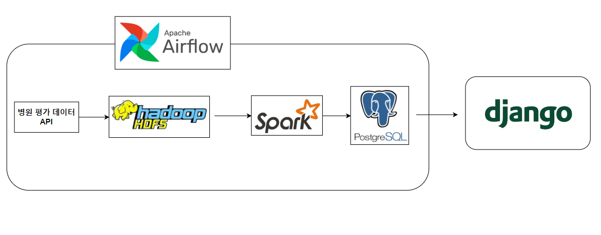
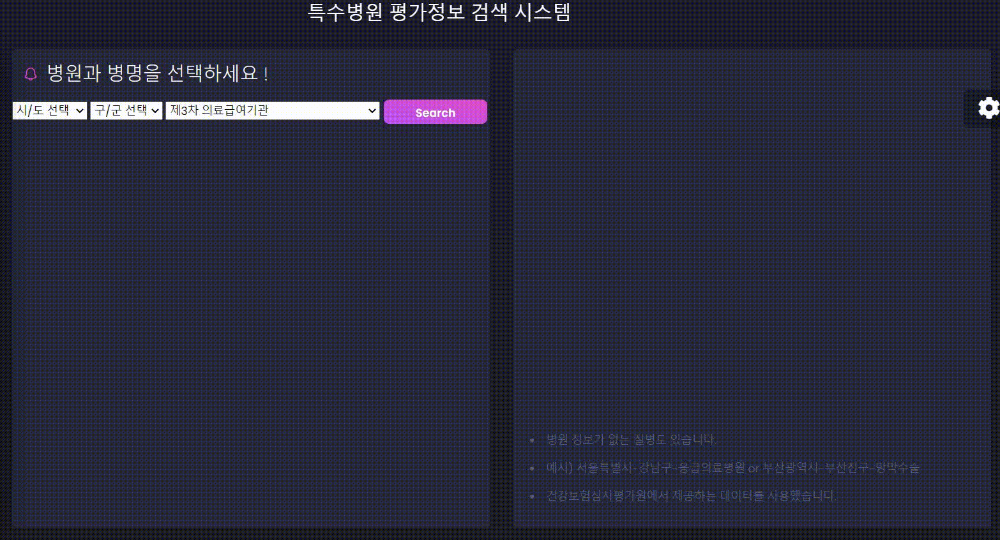
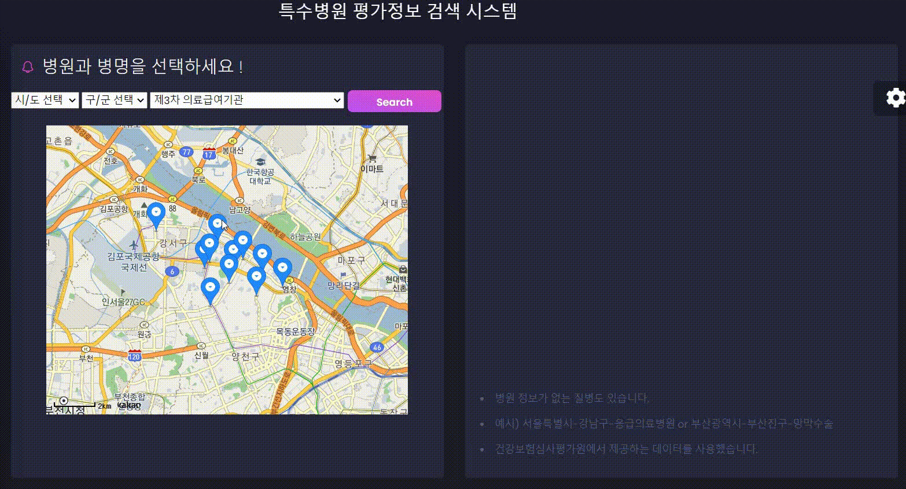

## 병원 평가 정보 시스템

본 프로젝트의 목적은 특수질병을 치료하는 병원 정보와 해당 병원의 평가 정보를 제공함에 있다.

## Architecture



## Setup

```bash
docker-compose up postgres
docker-compose up django
docker-compose up airflow-webserver
```


## 작동 방식


### 1. Data Ingestion

공공데이터포털에 있는 건강보험심사평가원에서 제공하는 API를 통해 병원평가정보를 가져와서 HDFS에 저장한다. 다음과 같은 두 개의 데이터를 가져온다.

#### (1) 특수 진료 병원 정보

**Column: ykiho(암호화된 병원 ID), name(병원명), addr(주소), srchCd(특수진료코드)**

해당 데이터를 통해 각 병원 마다 어떤 특수 질병을 담당하고 있는지 알 수 있다.

#### (2) 특수 병원 평가 정보

**Column: ykiho(암호화된 병원 ID), 병원 평가 항목 등급 1~23**

해당 데이터는 각 병원 마다 병을 얼마나 잘 진료하는지 항목별로 평가한 정보를 담고있다. 병원마다 23개의 질병 중 담당하고 있는 질병에 대해서만 점수가 있으며 1등급부터 5등급으로 나누어져있다. 원래는 등급이 낮을수록 좋은데, 본 프로젝트에서는 편의상 1등급->5점, 2등급->4점, ..., 5등급 -> 1점으로 점수를 변환하여서 사용하였다.

### 2. Data Transformation and Persist

두 개의 소스에서 얻은 데이터를 ykiho를 기준으로 join해서 하나의 table을 만든다. 합쳐진 table에 적절한 전처리를 수행하고 Postgres로 데이터를 전송한다. 모든 연산은 Spark에서 수행된다.

### 3. Visualize Data

Postgres에서 데이터를 Django로 가져와서 Chart.js를 통해 data를 시각화한다. 

**다음과 같이 지역 정보와 특수 질병 정보를 선택하면 해당 지역에 해당하는 병원 정보를 볼 수 있다. Kakao 지도 API를 사용해서 지도에 위치정보를 표시하였다.**



**다음과 같이 지도 위에 있는 병원을 클릭하면, 해당 병원의 평가 정보를 볼 수 있다.**




